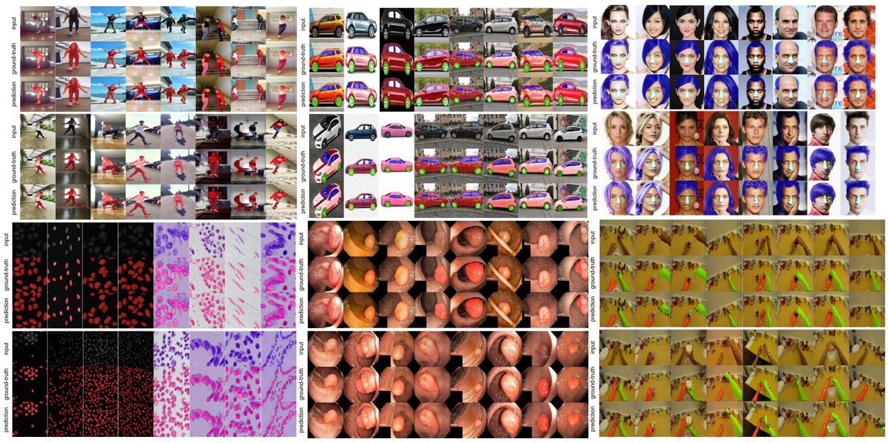
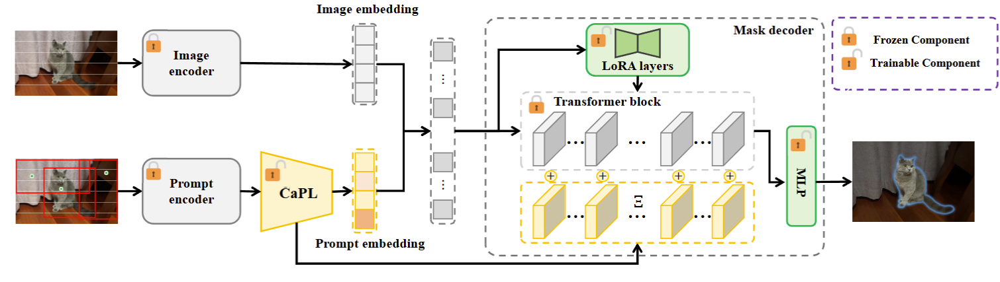

# CPC-SAM: An Simple and Powerful Model for Open-Vocabulary Segmentation


Official CODE of **Causal Prompt Calibration Guided Segment Anything Model for Open-Vocabulary Multi-Entity Segmentation**




## Introduction



Despite the strength of the Segment Anything Model (SAM), it struggles with generalization issues in open-vocabulary multi-entity segmentation (OVMS). Through empirical and causal analyses, we find that (i) the prompt bias is an important cause of the generalization issues in OVMS; (ii) this bias is closely tied to the task-irrelevant and entity-irrelevant generating factors within the prompts, which act as confounders and affect generalization. To address the generalization issues, this paper aims to propose a method that can calibrate prompts to eliminate confounders for accurate OVMS. Building upon the causal analysis, we propose that the optimal prompt for OVMS should contain only task-relevant and entity-relevant causal factors. We define this prompt as the causal prompt, serving as the goal of calibration. Next, our theoretical analyses, grounded by causal multi-distribution consistency theory and compressive sensing theory, prove that the causal prompts can be obtained by enforcing segmentation consistency, optimality, and sparsity. Inspired by this, we propose CPC-SAM, a Causal Prompt Calibration method that guides SAM to achieve accurate OVMS. It integrates a lightweight causal prompt learner (CaPL) into SAM to obtain causal prompts. Specifically, we first generate multiple prompts using random annotations to simulate diverse distributions. Then, we reweight the prompts via CaPL by enforcing causal multi-distribution consistency, optimality, and sparsity at both task and entity levels. To ensure the accuracy of reweighting, CaPL is optimized with SAM via a bi-level optimization strategy. Extensive experiments across various settings and benchmark datasets demonstrate the superiority of CPC-SAM, achieving accurate OVMS.


## Quick Start

**Step 1:** Create a virtual environment, activate it:

```
conda create -n cpc-sam python=3.9 -y
conda activate cpc-sam
```

**Step 2:** Install the requirements.

```
pip install -r requirements.txt
```

**Step 3:** Training.

General entry:

```
bash train.sh
```

Task‑specific entries:

```
python train_lung.py  --data_root /data/lung --sam_ckpt ./checkpoints/sam_vit_h_4b8939.pth
python train_cell.py  --data_root /data/cell --sam_ckpt ./checkpoints/sam_vit_h_4b8939.pth
python train_car.py   --data_root /data/car  --sam_ckpt ./checkpoints/sam_vit_h_4b8939.pth
...
```

**Step 4:** Inference.

```
bash inference.sh
```


## Cite

If you find our work and codes useful, please consider citing our paper and star our repository (🥰🎉Thanks!!!):
```
@article{wang2025causal,
  title={Causal Prompt Calibration Guided Segment Anything Model for Open-Vocabulary Multi-Entity Segmentation},
  author={Wang, Jingyao and Zhang, Jianqi and Qiang, Wenwen and Zheng, Changwen},
  journal={arXiv preprint arXiv:2505.06524},
  year={2025}
}
```
